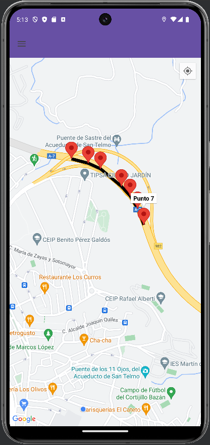
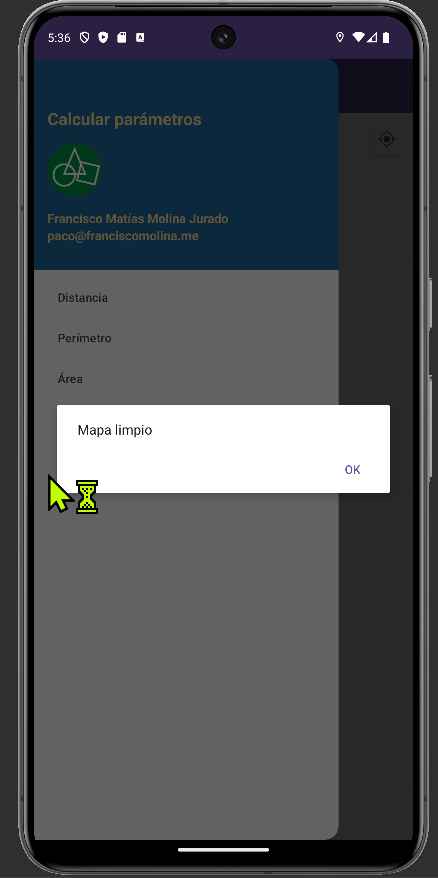

# Aplicación para la Medición de Fincas

Esta aplicación, desarrollada en Kotlin, tiene como objetivo principal la realización de mediciones de fincas mediante la unión de puntos para crear el polígono que representa dicha finca. Una vez generado el polígono, se procede al cálculo de parámetros específicos.

El ejercicio se centra en la implementación de funciones para calcular los metros cuadrados, el perímetro y la capacidad de borrar el mapa. Además, se ha agregado la opción de calcular la distancia entre dos puntos.

## Opciones
1. Distancia
2. Perímetro
3. Área
4. Borrar
5. Autor

## Funcionamiento de la Aplicación
La aplicación presenta un menú de opciones accesible desde un navegador ubicado a la izquierda que se despliega hacia la derecha para mostrar cada una de las funciones:

### Distancia
Esta función calcula la distancia total entre al menos dos puntos. Para realizar el cálculo, se debe hacer clic en cada punto deseado, y una vez seleccionados todos los puntos, se elige la opción "Distancia":

Una vez completado, se obtiene la distancia entre los puntos seleccionados, siempre desde el primer punto al último.

### Perímetro y Área
Estas funciones permiten calcular el perímetro y el área de la finca respectivamente. Para cerrar el polígono, es necesario hacer zoom máximo para precisar la ubicación del último punto. Una vez cerrado el polígono, se mostrará un diálogo confirmando el cierre:

Una vez cerrado el polígono, se puede proceder a calcular el perímetro y el área desde el navegador lateral:

#### Perímetro

#### Área

#### Borrar

## Gestión de Errores
La aplicación gestiona varios errores que el usuario pueda cometer:

1. Calcular una distancia después de cerrar el polígono.
2. Calcular el perímetro sin cerrar el polígono.
3. Calcular el área sin cerrar el polígono.

### 1. Calcular una distancia después de cerrar el polígono

### 2. Calcular el perímetro sin cerrar el polígono

### 3. Calcular el área sin cerrar el polígono

